<div align="center">



<br/>

<a href="https://github.com/enzopetit">
  
</a>


</div>

<br/>

## 🧠 About

```python
class EnzoPetit:
    def __init__(self):
        self.role = "Software Engineer"
        self.focus = ["AI", "Systems", "Web"]
        self.languages = ["C", "C++", "Python", "TypeScript", "Go"]
        self.currently_learning = "Pushing AI to its limits"

    def say_hi(self):
        print("Thanks for stopping by — let's build something great!")
```

<br/>

## 🛠️ Tech Stack

### Languages
<p>
  
  
  
  
  
  
  
  
  
  
</p>

### Frameworks
<p>
  
  
  
  
  
  
  
  
</p>

### Tools
<p>
  
  
  
</p>

<br/>

## 🏆 Trophies

<div align="center">


</div>

<br/>

<div align="center">


</div>
